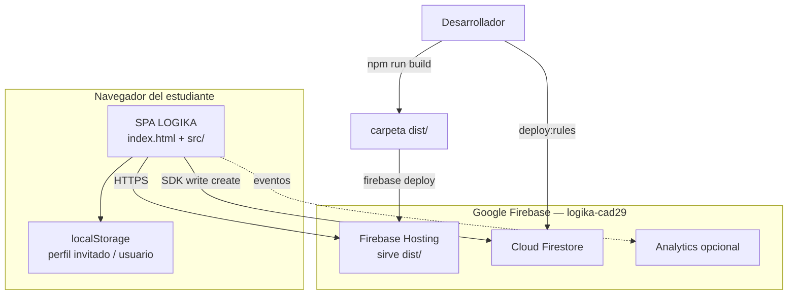
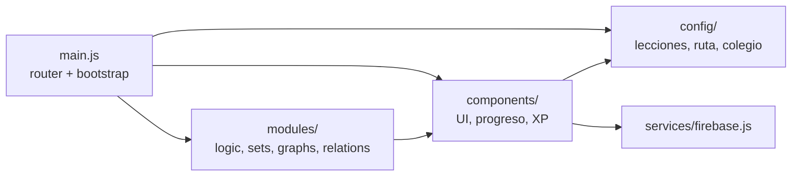
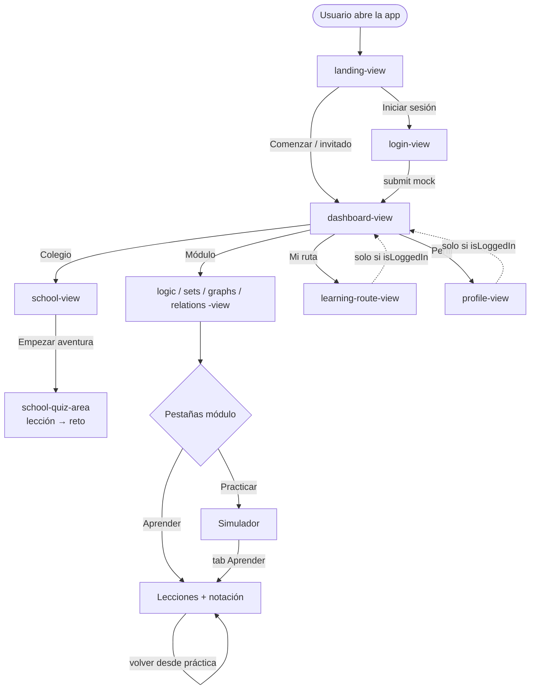
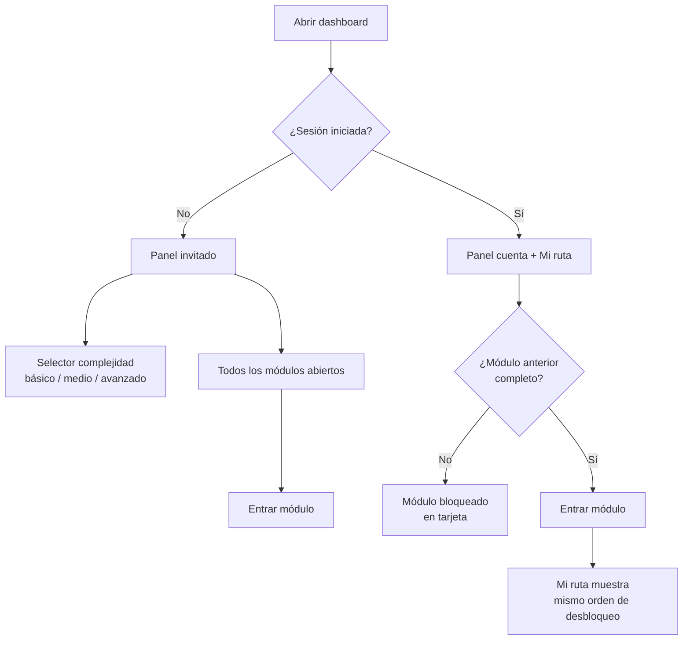
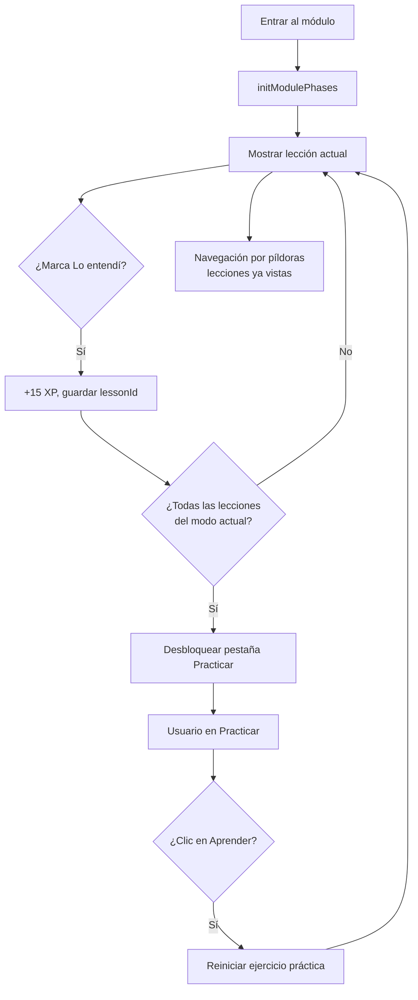
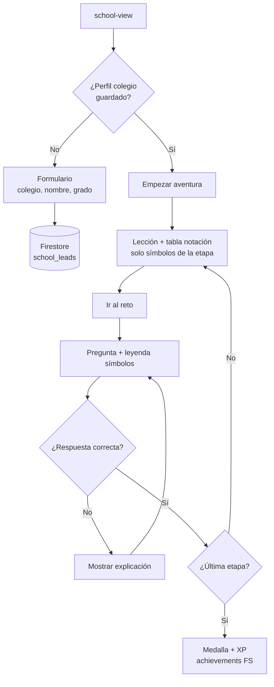
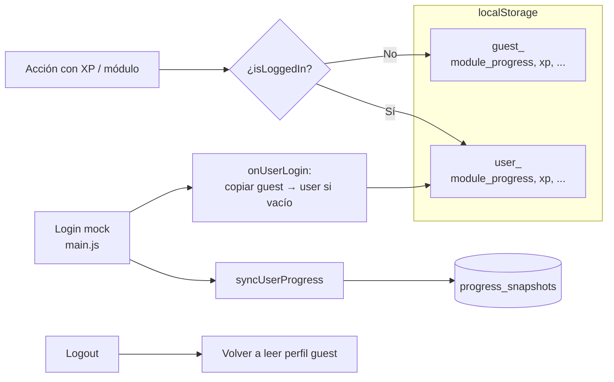
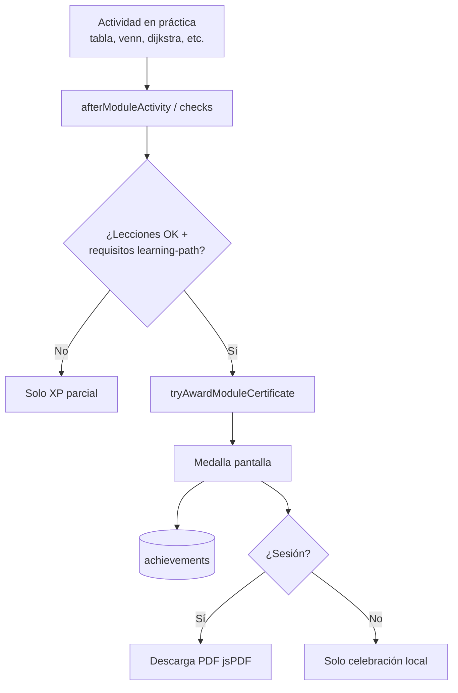
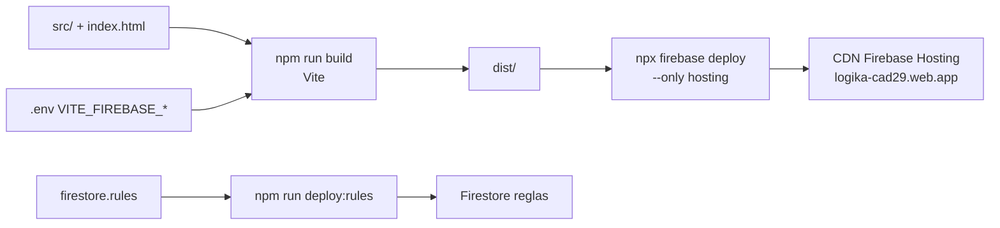
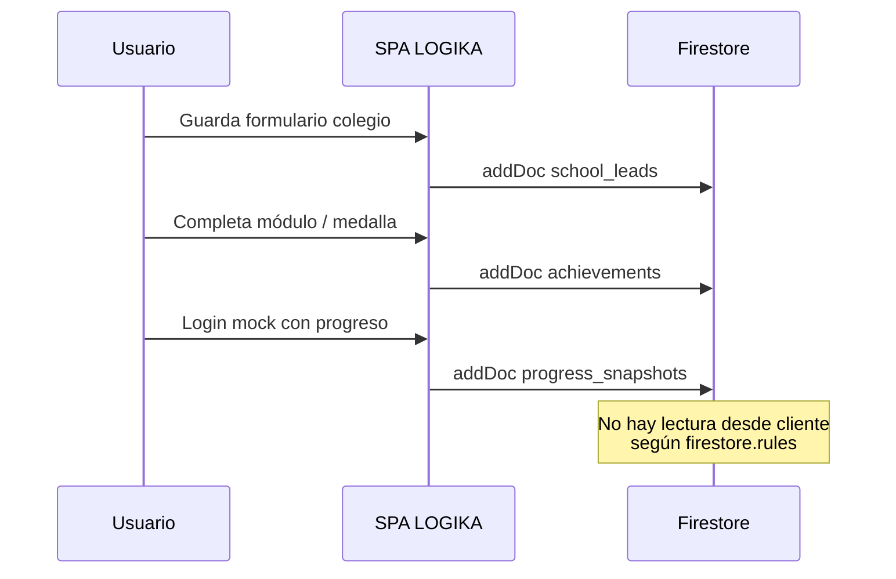

# Arquitectura y diagramas de flujo — LOGIKA

Diagramas en **Mermaid** (legibles en GitHub, VS Code y Cursor). Reflejan el comportamiento **actual** del código.

---

## 1. Arquitectura de despliegue (C4 simplificado)

---

## 2. Estructura lógica del frontend

---

## 3. Flujo de navegación (vistas)

---

## 4. Flujo modo invitado vs sesión (panel de módulos)

---

## 5. Flujo Aprender → Practicar (un módulo)

---

## 6. Flujo modo Colegio (aventura)

---

## 7. Flujo de persistencia (progreso y login mock)

---

## 8. Flujo de certificado (módulo completo)

---

## 9. Flujo de build y deploy

---

## 10. Flujo de datos Firestore (escrituras cliente)

---

## 11. Mapa de archivos por responsabilidad

| Flujo | Archivos principales |
|-------|----------------------|
| Router | `src/main.js`, `index.html` |
| Lecciones | `src/config/module-lessons.js`, `learn-notation.js`, `learn-visuals.js` |
| Modo invitado / ruta | `src/config/learning-mode.js`, `dashboard-ui.js`, `learning-route-ui.js` |
| Colegio | `src/config/school-adventure.js`, `main.js` (sección colegio) |
| Progreso | `progress.js`, `progress-profile.js`, `gamification.js` |
| Certificados | `certificates.js`, `medal.js`, `learning-path.js` |
| Firebase | `services/firebase.js`, `firestore.rules` |

---

## 12. Ver también

- [STACK-TECNOLOGICO.md](./STACK-TECNOLOGICO.md)
- [EJECUCION-Y-DEPLOY.md](./EJECUCION-Y-DEPLOY.md)
- [FORMULACION-PROYECTO-SCRUM.md](./FORMULACION-PROYECTO-SCRUM.md)
